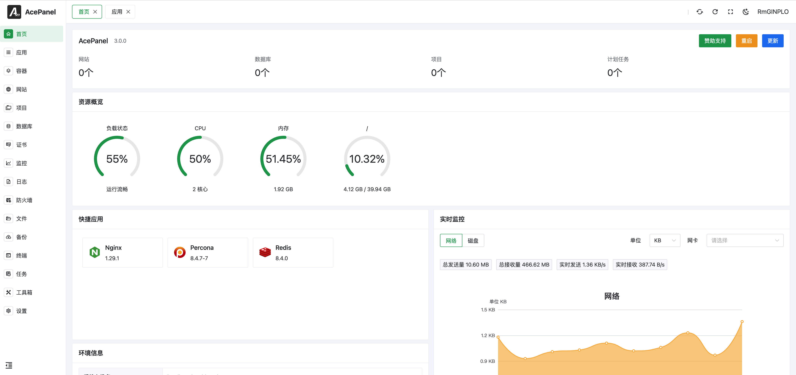

<p align="right">
[<a href="README.md">简体中文</a>] | [English]
</p>

<p align="center"><a href="https://acepanel.net"></a></p>

<p align="center">New generation of all-in-one server operation and maintenance management panel<br>Simple and lightweight, efficient operation and maintenance</p>

<div align="center">

Website: [acepanel.net](https://acepanel.net) | QQ group: [12370907](https://jq.qq.com/?_wv=1027&k=I1oJKSTH) | WeChat group: [Copy this link](https://work.weixin.qq.com/gm/d8ebf618553398d454e3378695c858b6)

</div>

<div align="center">

[](https://go.dev/)
[](https://github.com/acepanel/panel/releases)
[](https://github.com/acepanel/panel/actions)
[](https://goreportcard.com/report/github.com/acepanel/panel)
[](https://github.com/acepanel/panel)
[](https://opensource.org/license/bsd-3-clause)

</div>

## Advantages

1. **Extremely low occupancy:** Developed in Go language, small installation package, low occupancy, single file operation, will not affect system performance
2. **Low Destructiveness:** Designed to minimize additional modifications to the system, we make the fewest modifications to the system among similar products
3. **Follow the Times:** The overall design is at the forefront of the times, with good compatibility with new systems, leading in the same type of products
4. **Efficient Operation and Maintenance:** Complete functions, strong customization capabilities, can quickly deploy small websites, and deploy complex applications based on customized requirements
5. **Offline Operation:** Support offline mode, and even stop the panel process after deployment, without affecting any existing services
6. **Safe and Stable:** The panel adopts a variety of industry technologies to ensure the security of the body, and has been running stably in multiple survival environments for a long time
7. **Fully Open Source:** Few fully open source panels, you can freely modify and develop the panel on the premise of complying with the open source agreement
8. **Permanently free:** Commit to the panel body will not introduce any charging/authorization functions in the future, and will be permanently free to use

## Quick Install

Supported clean mainstream systems under `amd64` | `arm64` architecture, please refer to the [installation documentation](https://acepanel.github.io/en/quickstart/install) for specific supported systems.

```shell
bash <(curl -sSLm 10 https://dl.acepanel.net/helper.sh)
```

## UI Screenshots



## Partners

If the AcePanel is helpful to you, welcome to [sponsor us](https://github.com/acepanel/panel/issues/90), also thanks to the following supporters/sponsors:

<p align="center">
  <a href="https://www.weixiaoduo.com/">
    
  </a>
  <a href="https://www.dkdun.cn/aff/MQZZNVHQ">
    
  </a>
  <a href="https://cloud.panguidc.com/aff/DMRRFVJX">
    
  </a>
  <a href="https://waf.pro/">
    
  </a>
  <a href="https://scdn.ddunyun.com/">
    
  </a>
  <a href="https://1ms.run/">
    
  </a>
</p>

<p align="center">
  <a target="_blank" href="https://afdian.com/a/tnborg">
    
  </a>
</p>

## Star History

<a href="https://star-history.com/#acepanel/panel&Date">
 <picture>
   <source media="(prefers-color-scheme: dark)" srcset="https://api.star-history.com/svg?repos=acepanel/panel&type=Date&theme=dark" />
   <source media="(prefers-color-scheme: light)" srcset="https://api.star-history.com/svg?repos=acepanel/panel&type=Date" />
   
 </picture>
</a>
